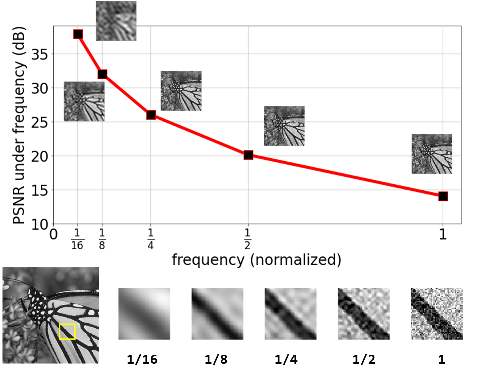
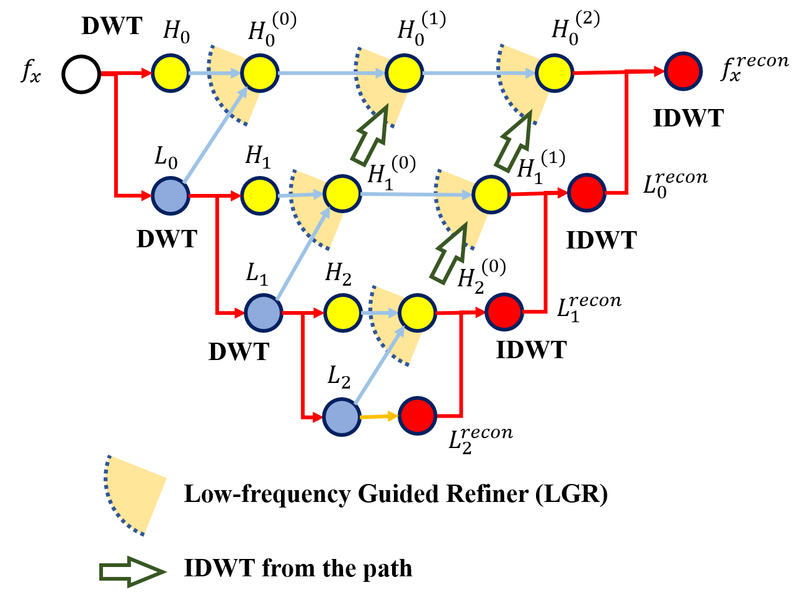
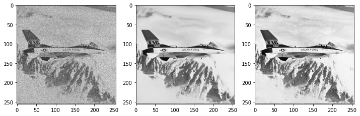
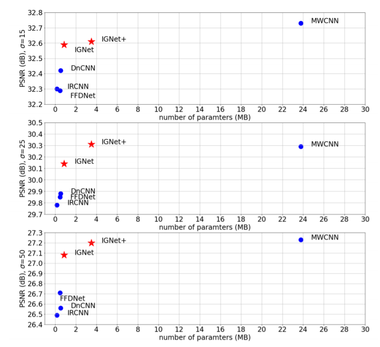

# IGNet (Inter-frequency Guided Denoise Network)
code of arxiv paper [Exploring Inter-frequency Guidance of Image for Lightweight Gaussian Denoising](https://arxiv.org/abs/2112.11779)



### Architecture




### Test pre-trained models

The pre-trained models for `sigma=25` are in `test_scripts/ckpts`, and the eval dataset Set12 is in `test_scripts/eval_dataset_h5` in h5 format (you can generate the h5 for other datasets e.g. BSD68 or Urban100 using the `prepare_eval_h5file` function in `dataloader_train400.py`)

Some example results (left: noisy, mid: denoised, right: clean):



### Train

```shell
mkdir ./logs
CUDA_VISIBLE_DEVICES=0 nohup python -u train_ignet_denoise.py --arch ignet --sigma 15 > logs/tr_ignet_sigma15.log 2>&1 &

# or run the bash file
sh bash_run_train.sh   # kill the training using 'sh bash_kill_train.sh'
```

modify the `configs/config_ignet[p]_sigma25.py` or write your own configure with the same format to change training settings.

For detailed training setups, please find in the paper.

### Results



### Reference:

```latex
@article{jia2021exploring,
  title={Exploring Inter-frequency Guidance of Image for Lightweight Gaussian Denoising},
  author={Jia, Zhuang},
  journal={arXiv preprint arXiv:2112.11779},
  year={2021}
}
```

